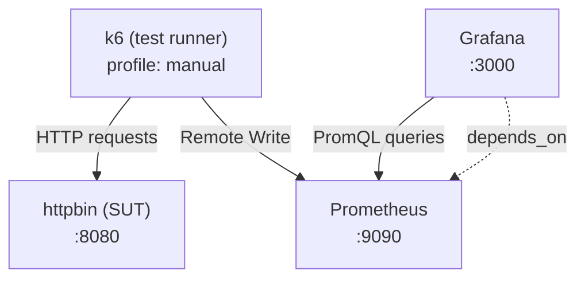

# Architecture

## Overview

The project runs a **fully containerized performance testing stack** on a single isolated Docker bridge network (`k6-net`). k6 acts as the test driver, pushes metrics to Prometheus via its native Remote Write integration, and Grafana visualizes those metrics through a pre-provisioned dashboard.

```
┌───────────────────────────────────────────────────────────┐
│                      k6-net (bridge)                      │
│                                                           │
│  ┌──────────┐   HTTP   ┌──────────┐                       │
│  │   k6     │─────────►│ httpbin  │  :8080                │
│  │(runner)  │          │  (SUT)   │                       │
│  └────┬─────┘          └──────────┘                       │
│       │ Remote Write                                      │
│       ▼                                                   │
│  ┌────────────┐  PromQL  ┌──────────┐                     │
│  │ Prometheus │◄─────────│ Grafana  │  :3000              │
│  │  :9090     │          │          │                     │
│  └────────────┘          └──────────┘                     │
└───────────────────────────────────────────────────────────┘
```

## Components

### k6 (Test Runner)
- Image: `grafana/k6:2.0.0`
- Defined under the `manual` Compose profile — never starts automatically.
- Mounts `./scripts` as read-only into `/scripts` inside the container.
- Pushes metrics via `K6_PROMETHEUS_RW_SERVER_URL=http://prometheus:9090/api/v1/write`.
- Native histograms enabled: `K6_PROMETHEUS_RW_TREND_AS_NATIVE_HISTOGRAM=true`.

### httpbin (System Under Test)
- Image: `mccutchen/go-httpbin:2.22.1`
- A predictable HTTP testing utility that responds to standard HTTP verbs.
- Endpoints used across scripts:
  - `/get` — simple GET, instant response.
  - `/delay/1` — 1-second artificial delay (used in stress & soak tests).
  - `/status/200` — immediate 200 response (used in spike test).

### Prometheus (Metrics Storage)
- Image: `prom/prometheus:v3.11.3`
- Remote Write Receiver enabled (`--enable-feature=remote-write-receiver`).
- Retention: 15 days (`--storage.tsdb.retention.time=15d`).
- Config file: `prometheus/prometheus.yml`.
- Scrapes itself on a 5 s interval.
- Data persisted in Docker volume `prometheus_data`.

### Grafana (Visualization)
- Image: `grafana/grafana:13.0.1-security-01`
- Anonymous admin access — no login required (intentional for local dev).
- Auto-provisioned via `grafana/provisioning/`:
  - **Datasource**: Prometheus at `http://prometheus:9090`.
  - **Dashboard**: k6 dashboard JSON loaded from `grafana/provisioning/dashboards/k6-dashboard.json`.
- Data persisted in Docker volume `grafana_data`.
- Depends on Prometheus (Compose `depends_on`).

## Data Flow

```
1. Developer runs:
   docker compose run --rm k6 run /scripts/01-smoke.js

2. k6 executes the script:
   - Sends HTTP requests to httpbin (http://httpbin/<endpoint>)
   - Collects metrics (duration, errors, VUs, etc.)

3. k6 pushes metrics:
   - POST http://prometheus:9090/api/v1/write  (Prometheus Remote Write v1)
   - Trend metrics as native histograms

4. Prometheus stores time-series data
   - 5 s scrape + remote write ingestion
   - 15-day retention

5. Grafana queries Prometheus:
   - Pre-provisioned dashboard auto-loads on startup
   - Real-time updates during test execution
```

## Network & Ports

| Service | Internal hostname | Exposed port |
|---|---|---|
| httpbin | `httpbin` | `8080` |
| Prometheus | `prometheus` | `9090` |
| Grafana | `grafana` | `3000` |
| k6 | `k6` | none |

All inter-service communication uses internal Docker DNS names (e.g., `http://httpbin/get`).

## Volumes

| Volume | Purpose |
|---|---|
| `prometheus_data` | Persists Prometheus TSDB across restarts |
| `grafana_data` | Persists Grafana state (dashboards, settings) |
| `./scripts` (bind mount) | Injects test scripts into k6 container at runtime |
| `./prometheus/prometheus.yml` (bind mount) | Prometheus config (read-only) |
| `./grafana/provisioning` (bind mount) | Grafana auto-provisioning (read-only) |

## Mermaid — Service Dependency Graph



## Key Technical Decisions

| Decision | Rationale |
|---|---|
| k6 under `manual` profile | Prevents k6 from starting with `docker compose up`; tests are triggered explicitly |
| Native histograms enabled | Higher-fidelity p95/p99 latency data in Prometheus |
| Anonymous Grafana admin | Simplifies local developer experience; not suitable for production |
| go-httpbin as SUT | Deterministic, zero-config target; supports latency simulation (`/delay/N`) |
| Read-only volume mounts | Prevents container from modifying host config files |
